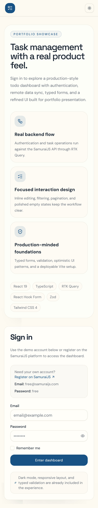
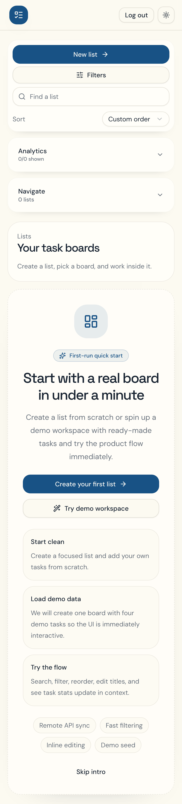
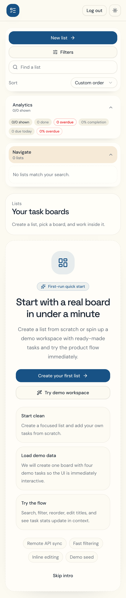

# Taskflow

Taskfolio is a portfolio-ready task management app built on top of the SamuraiJS API. The project focuses on product thinking, production-minded frontend architecture, and a polished user experience instead of a basic CRUD todo demo.

## Demo

- Live demo: https://task-flow-samkr.vercel.app/
- Recommended for reviewers: click `Enter demo mode` on the login screen. It works without SamuraiJS credentials and does not depend on external API availability.
- SamuraiJS credentials, if you want to try the real backend:
  - Email: `free@samuraijs.com`
  - Password: `free`

## Stack

- React 19
- TypeScript
- Vite
- Redux Toolkit + RTK Query
- React Router 7
- Tailwind CSS 4
- Radix UI
- React Hook Form
- Zod
- Vitest + Testing Library
- Vercel deployment with direct SamuraiJS API access

## Features

- Zero-setup demo mode for portfolio review and product walkthroughs
- Auth flow against the SamuraiJS backend
- Real remote CRUD for todolists and tasks
- Responsive dashboard layout for desktop and mobile
- Global task filters synced with the URL
- Debounced task search with active filter chips
- Drag-and-drop reorder for todolists
- Inline editing for list titles and tasks
- Pagination for remote task lists
- Onboarding flow with demo seed data
- Compact analytics and task stats
- Light / dark theme support
- Empty states, loading states, and production deploy flow

## Architecture

The app is split into feature-oriented and page-oriented layers:

- `src/feature/*` contains domain features such as auth, todolists, and API slices
- `src/app/main/*` contains page-specific composition for the todolists dashboard
- `src/common/*` contains shared UI primitives, hooks, helpers, and types
- `vite.config.ts` proxies SamuraiJS requests in local development

The main page is intentionally decomposed into:

- `lib` for derived state, filtering, stats aggregation, reorder, onboarding
- `model` for constants and types
- `ui` for presentational sidebar and page blocks

## Screenshots / GIF

### Login



### Dashboard



### Mobile



Assets are generated through [`docs/capture-readme-assets.spec.ts`](docs/capture-readme-assets.spec.ts).

If you update the UI, refresh them with:

```bash
pnpm exec playwright test docs/capture-readme-assets.spec.ts --reporter=line
```

## Technical Decisions

### 1. Split API access by environment

Both local development and production use the same `/samurai-api` entrypoint. Vite handles it with a dev proxy locally, and Vercel rewrites it to the serverless Samurai proxy in production so browser CORS does not block auth.

### 2. Built-in demo mode for evaluators

The login screen includes a local `Demo mode` entry point. It skips SamuraiJS authentication entirely and opens an interactive in-memory workspace so reviewers can evaluate the UI, flows, filters, and editing experience even if public API credentials are blocked by domain restrictions.

### 3. RTK Query as the data layer

RTK Query is used for remote state, caching, invalidation, and optimistic update patterns. This keeps API concerns close to the feature slices and avoids duplicating loading/error/cache logic across components.

### 4. URL-synced global task filters

Global task filters are stored in search params, not only in local component state. That makes filter state shareable, refresh-safe, and more product-like.

### 5. Derived state moved out of page components

Filtering, sorting, stats aggregation, onboarding, and reorder logic were extracted into helpers and hooks under `src/app/main/lib`. This keeps the page component focused on orchestration instead of becoming a single large stateful file.

### 6. Mobile and desktop sidebar separation

The sidebar is intentionally split into desktop and mobile variants. This prevents the mobile UI from inheriting the full desktop information density and makes the interaction model cleaner: compact controls, collapsible navigation, collapsible analytics, and a floating create action.

### 7. First-run product flow

Instead of showing a dead empty state, the app includes onboarding and demo seed data. A user can either create the first list or load a ready-made demo workspace and interact with a realistic scenario immediately.

### 8. Tests focused on product-critical logic

The test layer prioritizes the parts that matter most for reliability:

- filter normalization and search-param sync
- task stats aggregation
- todolist sorting and reorder rules
- sidebar filters UI
- list navigation
- create-list dialog flow

## Local Setup

```bash
pnpm install
pnpm dev
```

Open `http://localhost:3000`.

## Scripts

```bash
pnpm dev
pnpm build
pnpm preview
pnpm test
pnpm test:run
```

## Environment

Create `.env` from `.env.example` and provide:

```bash
VITE_API_KEY=your_samurai_api_key
```

For local development, also create `.env.development` from `.env.development.example`:

```bash
VITE_BASE_URL=/samurai-api
```

Client requests always go through `/samurai-api`. In local development Vite proxies that path, and on Vercel the rewrite points it to the serverless Samurai proxy.

## Testing

The project includes:

- unit tests for filters, stats, and sorting helpers
- component/integration tests for sidebar filters, navigation, and create-list dialog

Run all tests:

```bash
pnpm test:run
```

## Deployment Notes

- Local development proxies `/samurai-api` through Vite
- Production builds call SamuraiJS directly
- `vercel.json` is only used for SPA route fallback on Vercel

## What I Would Add Next

- Browser E2E coverage with Playwright
- Task reorder on the main board itself
- Richer task analytics history
- More advanced task metadata in the UI
- Shareable filtered views and saved presets
